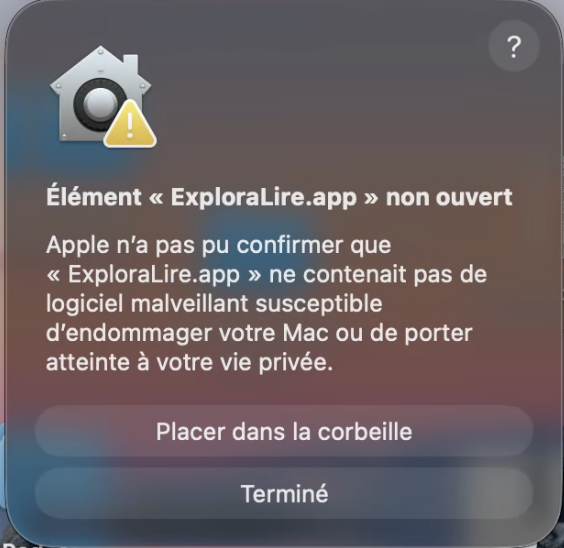
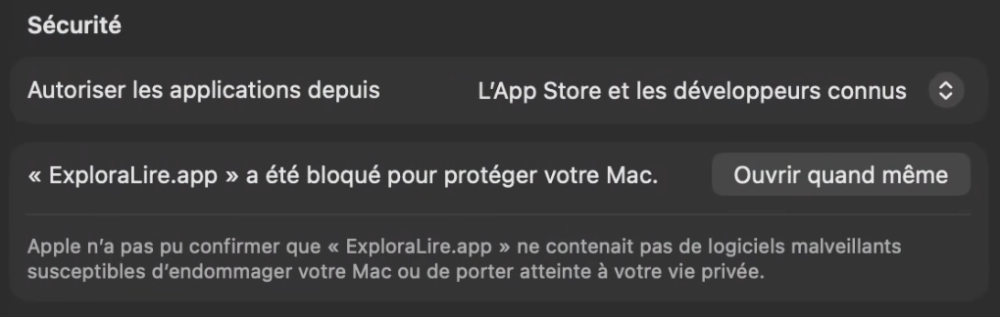
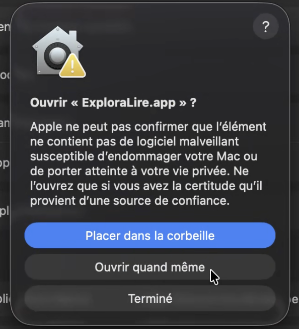

# Téléchargement et installation d'ExploraLire

## Pré-requis

Aucun pré-requis n'est nécessaire. ExploraLire est une application autonome qui embarque tout ce dont elle a besoin.

> **Note :** ExploraLire fonctionne entièrement hors-ligne. Aucune connexion internet n'est nécessaire après le téléchargement.

## 1. Téléchargement

Rendez-vous sur la page de téléchargement :
**https://github.com/Sydher/ExploraLire/releases/latest**

Téléchargez le fichier correspondant à votre système :

| Système | Fichier à télécharger |
|---------|-----------------------|
| Windows | `ExploraLire-xxx-windows-x86_64.exe` |
| macOS   | `ExploraLire-xxx-macos-aarch64.zip` |
| Linux   | `ExploraLire-xxx-linux-x86_64` |

## 2. Installation

### Windows

Aucune installation requise. Conservez le fichier `.exe` à un emplacement de votre choix (par exemple le Bureau ou un dossier dédié). Ce fichier servira à lancer le logiciel à chaque utilisation.

> **Astuce :** Vous pouvez créer un raccourci vers le fichier `.exe` pour y accéder plus facilement.

### macOS

1. Décompressez le fichier `.zip` téléchargé
2. Déplacez le fichier `ExploraLire.app` dans votre dossier **Applications**
3. Lancez le logiciel une première fois : la sécurité Apple bloquera l'ouverture
   
4. Cliquer sur **Terminé**
5. Ouvrez **Réglages Système** > **Confidentialité et sécurité**
6. Trouvez le message _"ExploraLire.app a été bloqué pour protéger votre Mac"_
   
7. Cliquez sur **Ouvrir quand même**
8. Relancer le logiciel
   
9. Cliquez sur **Ouvrir quand même**
10. Les lancements suivants fonctionneront normalement

### Linux

Aucune installation requise. Conservez le fichier runner téléchargé. Rendez-le exécutable si nécessaire :

```bash
chmod +x ExploraLire-*-linux-x86_64
```

## 3. Comment ça fonctionne ?

ExploraLire se compose de deux parties :

1. **Le serveur** : un petit programme qui s'ouvre dans une fenêtre de terminal (ou en arrière-plan sur macOS). C'est lui qui fait tourner l'application. **Cette fenêtre doit rester ouverte** tant que vous utilisez ExploraLire.
2. **Le navigateur** : l'application s'utilise ensuite dans votre navigateur internet habituel (Chrome ou Firefox recommandés).

> **En résumé :** le serveur garde l'application allumée, le navigateur vous permet de l'utiliser, et c'est en fermant le serveur que vous quittez complètement ExploraLire.

## 4. Lancement

Démarrez le serveur selon votre système :

| Système | Comment lancer |
|---------|----------------|
| Windows | Double-cliquez sur le fichier `.exe` |
| macOS   | Lancez depuis le Launchpad, Spotlight ou le dossier Applications |
| Linux   | Exécutez `./ExploraLire-*-linux-x86_64` dans un terminal |

Puis ouvrez votre navigateur (Chrome ou Firefox recommandés) à l'adresse :

**http://localhost:8080**

> **Astuce :** Le serveur peut prendre quelques secondes à démarrer. Si la page ne s'affiche pas immédiatement, patientez puis rechargez la page.

## 5. Arrêt

Pour quitter complètement ExploraLire, il faut fermer le serveur :

- **Windows / Linux :** Fermez la fenêtre du terminal ou appuyez sur `Ctrl+C`
- **macOS :** Quittez l'application normalement

> **Note :** Fermer l'onglet du navigateur ne suffit pas à arrêter ExploraLire. Le serveur continue de tourner tant qu'il n'est pas fermé explicitement.

## Besoin d'aide ?

Ouvrez un ticket sur : **https://github.com/Sydher/ExploraLire/issues**
